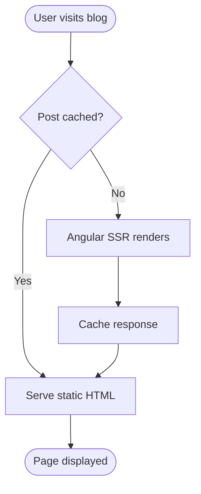
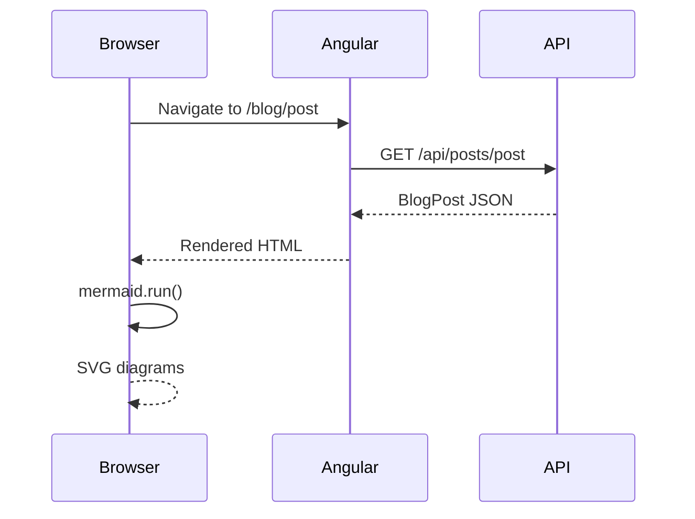
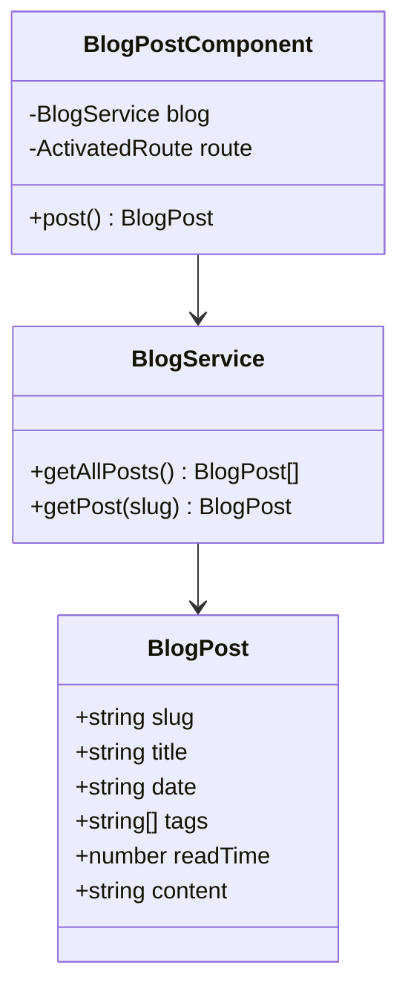
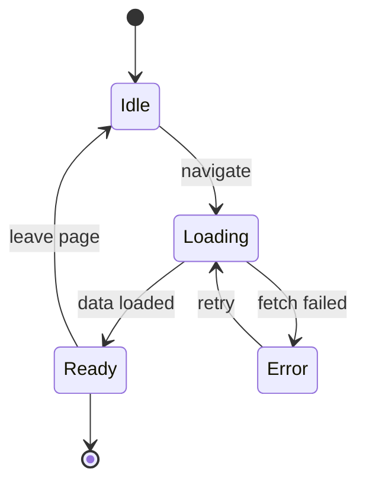
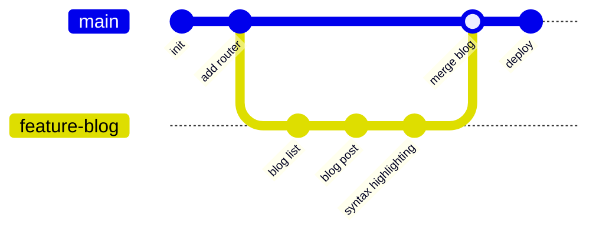

This post demonstrates the supported code languages and diagram types.

## Syntax Highlighting

### TypeScript

```typescript
interface User {
  id: number;
  name: string;
  role: "admin" | "viewer";
}

async function fetchUser(id: number): Promise<User> {
  const res = await fetch(`/api/users/${id}`);
  if (!res.ok) throw new Error(`HTTP ${res.status}`);
  return res.json() as Promise<User>;
}

// Angular signal example
const count = signal(0);
const doubled = computed(() => count() * 2);
effect(() => console.log("doubled:", doubled()));
```

### JavaScript

```javascript
const debounce = (fn, ms) => {
  let timer;
  return (...args) => {
    clearTimeout(timer);
    timer = setTimeout(() => fn(...args), ms);
  };
};

const search = debounce(async (query) => {
  const results = await fetch(`/search?q=${query}`).then((r) => r.json());
  renderResults(results);
}, 300);
```

### CSS

```css
.card {
  background: oklch(0.98 0.01 272 / 60%);
  border: 1px solid oklch(0.9 0.02 272);
  border-radius: 1rem;
  padding: 1.5rem;
  backdrop-filter: blur(12px);
  transition:
    transform 200ms ease,
    box-shadow 200ms ease;
}

.card:hover {
  transform: translateY(-2px);
  box-shadow: 0 8px 24px oklch(0.62 0.19 272 / 15%);
}
```

### Bash

```bash
# Install dependencies and build
npm ci
node scripts/build-blog.mjs
ng build --configuration production

# Deploy to GitHub Pages
gh-pages -d dist/browser
```

### JSON

```json
{
  "name": "jellebruisten",
  "scripts": {
    "build:blog": "node scripts/build-blog.mjs",
    "build": "npm run build:blog && ng build"
  },
  "dependencies": {
    "@angular/core": "^21.2.0",
    "mermaid": "^11.0.0"
  }
}
```

### Python

```python
from dataclasses import dataclass
from typing import Optional

@dataclass
class BlogPost:
    slug: str
    title: str
    date: str
    tags: list[str]
    read_time: int
    content: Optional[str] = None

def sort_by_date(posts: list[BlogPost]) -> list[BlogPost]:
    return sorted(posts, key=lambda p: p.date, reverse=True)
```

### SQL

```sql
SELECT
  p.slug,
  p.title,
  p.date,
  COUNT(v.id) AS views
FROM posts p
LEFT JOIN views v ON v.post_id = p.id
WHERE p.published = true
GROUP BY p.id
ORDER BY p.date DESC
LIMIT 10;
```

---

## Mermaid Diagrams

### Flowchart



### Sequence Diagram



### Class Diagram



### State Diagram



### Git Graph


