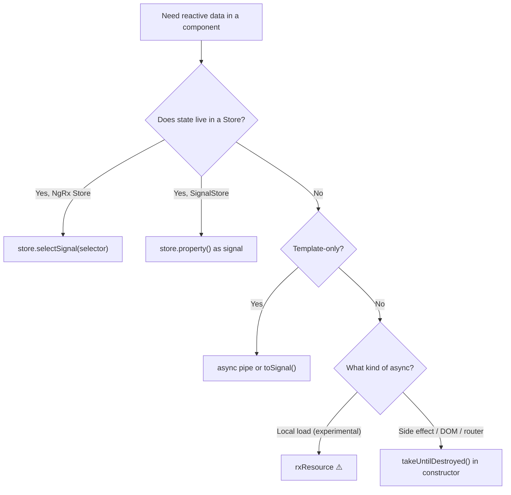

Memory leaks from forgotten subscriptions are one of the most common Angular bugs, and one of the quietest. No error is thrown. The component disappears from the DOM. But somewhere, an observable is still firing, updating state that no longer exists, or holding references that prevent garbage collection.

In a long-running SPA it compounds: every navigation to a route creates another subscription, and another. You end up with ten listeners where you expected one.

Modern Angular gives you great tools to avoid all of this. But first, a principle worth internalising:

> **The best subscription is one you never create.**

## Don't Subscribe: Declare

Before reaching for `.subscribe()`, ask whether Angular can own the subscription for you. Usually it can.

### The `async` Pipe

The `async` pipe subscribes when the component is created and unsubscribes when it's destroyed, automatically, with zero lifecycle hooks:

```typescript
@Component({
  template: `
    @if (user$ | async; as user) {
      <h1>Hello, {{ user.name }}</h1>
    }
  `,
})
export class ProfileComponent {
  protected user$ = inject(UserService).currentUser$;
}
```

No `ngOnInit`. No `ngOnDestroy`. No subscription variable. This is the baseline declarative approach and works perfectly with `OnPush`: Angular triggers change detection every time the pipe receives a new value.

### `toSignal()`

When you need the value in component logic (not just the template), `toSignal` bridges RxJS and signals:

```typescript
@Component({ ... })
export class DashboardComponent {
  private userService = inject(UserService);

  protected user = toSignal(this.userService.currentUser$);
  protected stats = toSignal(this.userService.stats$, { initialValue: [] });

  // Works like any signal in computed / effects
  protected greeting = computed(() => `Hello, ${this.user()?.name ?? 'stranger'}`);
}
```

`toSignal` creates the subscription inside the injection context and cleans it up with the component. Unlike the `async` pipe, the value is available as a plain signal anywhere in the class with no pipe syntax needed.

**`async` pipe vs `toSignal`:** use `async` when the observable is only consumed in the template, particularly with `@if` or `@for`. Use `toSignal` when you need the value in computed logic or side effects too.

## Pattern 1: `takeUntilDestroyed`

When you genuinely need to subscribe imperatively, for side effects, DOM coordination, or complex operator chains, `takeUntilDestroyed` is the modern answer:

```typescript
import { takeUntilDestroyed } from '@angular/core/rxjs-interop';

@Component({ ... })
export class SearchComponent {
  private results = signal<SearchResult[]>([]);

  constructor(private api: SearchService) {
    inject(ActivatedRoute).queryParams.pipe(
      map(p => p['q'] ?? ''),
      debounceTime(300),
      distinctUntilChanged(),
      switchMap(query => api.search(query)),
      takeUntilDestroyed()
    ).subscribe(results => this.results.set(results));
  }
}
```

`takeUntilDestroyed()` hooks into `DestroyRef` automatically. No subject, no lifecycle method. Call it inside an injection context (constructor or field initialiser). If you need it elsewhere, pass the ref explicitly:

```typescript
class AnalyticsService {
  private destroyRef = inject(DestroyRef);

  startTracking() {
    interval(5000)
      .pipe(takeUntilDestroyed(this.destroyRef))
      .subscribe(() => this.flush());
  }
}
```

## The Nested Subscription Antipattern

This is the mistake that causes the most subtle bugs, and it's rarely discussed:

```typescript
// ❌ Never subscribe inside subscribe
ngOnInit() {
  this.route.params.subscribe(params => {
    this.api.getUser(params['id']).subscribe(user => {
      this.user = user;
    });
  });
}
```

If `route.params` emits three times (user navigates back and forward), you now have **three active HTTP subscriptions** all racing to update the same property. Each navigation adds another layer. Even if the HTTP observable completes, the outer subscription is still leaking.

Fix this with a **flattening operator**:

```typescript
// ✅ switchMap cancels the previous inner observable on each new emission
constructor() {
  inject(ActivatedRoute).params.pipe(
    map(p => p['id']),
    switchMap(id => this.api.getUser(id)),
    takeUntilDestroyed()
  ).subscribe(user => this.user.set(user));
}
```

`switchMap` cancels the in-flight HTTP request when a new route param arrives. One active subscription, correct semantics, no race conditions.

The choice of flattening operator carries meaning; pick the wrong one and the bug is subtle:

| Operator     | Behaviour                            | When to use                            |
| ------------ | ------------------------------------ | -------------------------------------- |
| `switchMap`  | Cancel previous on new emission      | Search, navigation, autocomplete       |
| `concatMap`  | Queue, wait for previous to complete | Ordered saves, sequential requests     |
| `mergeMap`   | Allow concurrent inner observables   | Parallel, independent requests         |
| `exhaustMap` | Ignore new while inner is active     | Submit buttons, preventing double-send |

## `takeUntil` Operator Ordering

When using `takeUntil` manually, position matters. Operators placed **after** `takeUntil` can still fire after the subject emits, including `retry`, which will resubscribe:

```typescript
// ❌ retry runs after takeUntil — can resubscribe after component destroy
obs$.pipe(takeUntil(destroy$), retry(3));

// ✅ takeUntil last, cleanup always wins
obs$.pipe(retry(3), takeUntil(destroy$));
```

The same applies to `takeUntilDestroyed`. Keep it as the **last operator** before `.subscribe()`.

## NgRx Store and SignalStore

In real-world applications, HTTP requests rarely go directly into a component. State lives in a store, and components read from it. This changes the subscription picture entirely: **the component subscribes to nothing**. The store owns the lifecycle.

### NgRx Store (selector to signal)

```typescript
@Component({ ... })
export class UserProfileComponent {
  private store = inject(Store);

  // selectSignal returns a Signal<T>, auto-cleaned up
  protected user    = this.store.selectSignal(selectCurrentUser);
  protected loading = this.store.selectSignal(selectUserLoading);
  protected error   = this.store.selectSignal(selectUserError);

  load(id: string) {
    this.store.dispatch(UserActions.load({ id }));
  }
}
```

The subscription is buried inside the store infrastructure. Your component dispatches actions and reads signals. No cleanup required.

### NgRx SignalStore

SignalStore takes this further: the store itself is signal-native.

```typescript
export const UserStore = signalStore(
  withState({ user: null as User | null, loading: false }),
  withMethods((store, api = inject(UserService)) => ({
    load: rxMethod<string>(
      pipe(
        switchMap(id => api.getUser(id)),
        tapResponse({
          next: user => patchState(store, { user, loading: false }),
          error: ()  => patchState(store, { loading: false })
        })
      )
    )
  }))
);

@Component({
  providers: [UserStore],
  ...
})
export class UserProfileComponent {
  protected store = inject(UserStore);
  // store.user(), store.loading() are plain signals
}
```

`rxMethod` inside SignalStore manages its own subscription and cleans up when the store (or providing component) is destroyed. The component never calls `.subscribe()`.

### When the store doesn't help

State management is the right home for HTTP, but not for everything. Subscriptions you still handle yourself:

- **Router params / query params:** scoped to one component, no shared state needed
- **Form value changes:** `valueChanges` tied to a form's lifetime
- **DOM events:** `fromEvent`, `ResizeObserver`, `IntersectionObserver`
- **WebSocket streams:** unless you're pushing events into the store

For these, `takeUntilDestroyed()` remains the right tool.

## `rxResource` — Experimental

Angular 19 added `rxResource` as a signal-based abstraction for local async loading. It's worth knowing it exists, but it's still marked **experimental** and the API may change:

```typescript
// ⚠️ Experimental API, check Angular release notes before using in production
import { rxResource } from '@angular/core/rxjs-interop';

protected userResource = rxResource({
  request: () => ({ id: this.userId() }),
  loader: ({ request }) => inject(UserService).getUser(request.id)
});
```

It handles loading state, cancellation, and cleanup automatically. If you're building a small component without a store and want a self-contained loading pattern, it's promising. Just track its stability status before committing to it in production.

## Direct Cleanup with `DestroyRef`

For non-observable resources like `setInterval`, WebSocket connections, and third-party listeners, use `DestroyRef.onDestroy` directly:

```typescript
@Injectable({ providedIn: "root" })
export class WebSocketService {
  private destroyRef = inject(DestroyRef);

  connect(url: string) {
    const ws = new WebSocket(url);

    this.destroyRef.onDestroy(() => {
      ws.close();
    });

    return fromEvent<MessageEvent>(ws, "message").pipe(map((e) => JSON.parse(e.data)));
  }
}
```

This is the low-level primitive that `takeUntilDestroyed` builds on. Reach for it when you're bridging non-RxJS async resources.

## Choosing the Right Pattern



## Quick Reference

| Scenario                        | Pattern                                |
| ------------------------------- | -------------------------------------- |
| State in NgRx Store             | `store.selectSignal(selector)`         |
| State in NgRx SignalStore       | `store.property()` signal              |
| HTTP inside store               | NgRx Effects / `rxMethod`              |
| Template-only value             | `async` pipe or `toSignal()`           |
| Value needed in class logic     | `toSignal()`                           |
| Derived from multiple signals   | `computed()`                           |
| Local async load (experimental) | `rxResource` ⚠️                        |
| Imperative side effect          | `takeUntilDestroyed()` in constructor  |
| Nested observables              | Flattening operator (`switchMap` etc.) |
| Non-observable async cleanup    | `DestroyRef.onDestroy()`               |

## The Priority Order

When you encounter a subscription need, run through this checklist:

1. **Is there a store?** Read from it with `selectSignal` or signal properties. Don't subscribe.
2. **Is HTTP going into a store?** Put it in an Effect or `rxMethod`, not the component.
3. **Is it template-only?** Use `async` pipe or `toSignal`.
4. **Do I need it in class logic?** Use `toSignal`.
5. **Is it a genuine side effect?** `takeUntilDestroyed()` in the constructor.
6. **Am I subscribing inside a subscribe?** Stop. Use a flattening operator.

The goal isn't to memorise patterns; it's to develop an instinct for ownership. Every subscription you create is your responsibility. The modern Angular toolset makes that responsibility easy to honour, you just have to reach for the right tool.
