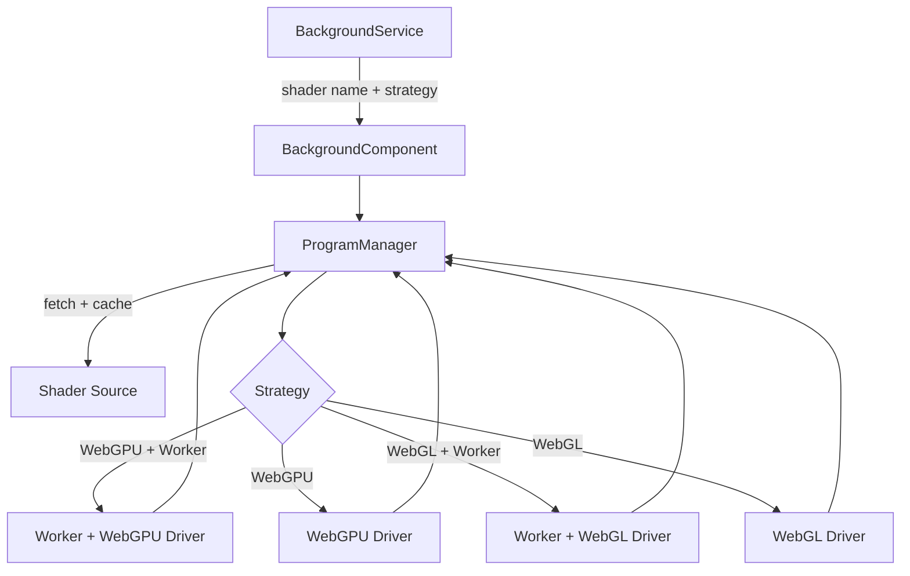

Every time you open this site, a fullscreen animated background is running. It's a GLSL or WGSL fragment shader rendered to a canvas, selected by the day of the year, adapting to your colour scheme, and — where possible — running on a Web Worker so it never touches the main thread.

This post is a walkthrough of how the system is built.

## Daily Rotation

There are six active backgrounds: aurora, particles, perlin noise, snow, shapes, and ocean. The one you see today is picked deterministically from that list based on the day of the year:

```typescript
function pickDailyBackground(): BackgroundName {
  const d = new Date();
  const day = Math.floor(
    (d.getTime() - new Date(d.getFullYear(), 0, 0).getTime()) / 86_400_000
  );
  return availableBackgrounds[day % availableBackgrounds.length];
}
```

No server, no randomness. The same day always shows the same background for everyone. It cycles every six days.

## Architecture

The system has three layers:

**BackgroundService** picks the current shader name and strategy (which rendering API to use). It exposes these as signals.

**BackgroundComponent** is a fixed, fullscreen Angular component that reacts to those signals. When the strategy or shader name changes, it tears down the old program and starts a new one.

**ProgramManager** handles the actual lifecycle: creating the canvas, fetching the shader source, initialising the driver, and managing the render loop.

The driver sits at the bottom. There are three variants: a WebGL 2 driver, a WebGPU driver, and a Web Worker bridge that wraps either one for offscreen rendering. All three implement the same interface:

```typescript
interface RenderProgramHandles {
  pause(): void;
  resume(): void;
  stop(): void;
  resize(width: number, height: number): void;
  setDarkMode(value: number): void;
}
```

The rest of the application never knows which driver is actually running.



## WebGPU First, WebGL Fallback

On load, the runtime probes the browser and picks the best available API:

1. WebGPU with offscreen canvas (Chromium, latest Edge)
2. WebGPU on main thread
3. WebGL 2 with offscreen canvas
4. WebGL 2 on main thread

WebGL 2 is supported in every modern browser, so there is always a fallback. WebGPU gets used where it's available because it has lower driver overhead and more explicit GPU control — though for a fullscreen quad with a single fragment shader, the practical performance difference is small.

## Two Shader Languages, One System

Because WebGL uses GLSL and WebGPU uses WGSL, each background is written twice. The structure is identical — every shader receives three uniforms:

```glsl
// WebGL (GLSL)
uniform vec2  u_resolution;
uniform float u_time;
uniform float u_darkmode;
```

```wgsl
// WebGPU (WGSL)
struct Uniforms {
  iResolution : vec2f,
  iTime       : f32,
  iDarkmode   : f32,
}
@group(0) @binding(0) var<uniform> u : Uniforms;
```

The vertex shader in both cases is just a hardcoded fullscreen quad — two triangles covering clip space. All the interesting work happens in the fragment shader, which runs once per pixel every frame.

## The Uniform Pipeline

Each frame, the driver updates the uniform buffer and issues a draw call:

```typescript
// WebGPU path
const uniformData = new Float32Array([
  canvas.width,
  canvas.height,
  accumulatedTime / 1000,
  darkModeValue,
]);
device.queue.writeBuffer(uniformBuffer, 0, uniformData.buffer);
```

`accumulatedTime` is the sum of frame deltas, capped at 50ms per frame. Without the cap, a browser tab that's been backgrounded for a minute would resume and send a 60-second time jump to the shader, which causes most noise-based shaders to produce garbage for a few frames.

On mobile (viewport width under 768px), the canvas renders at half resolution. This cuts the fragment shader invocations to a quarter and makes a real difference on lower-end devices, with no visible quality loss at typical viewing distance.

## Dark Mode as a Uniform

Dark mode isn't applied with CSS. The shader receives a `darkmode` float between 0.2 (dark) and 1.0 (light), and each shader implements its own palette blending:

```glsl
float darkness = clamp(1.0 - (u_darkmode - 0.2) / 0.8, 0.0, 1.0);
vec3 colour = mix(lightColour, darkColour, darkness);
```

This means each shader can define completely different palettes for dark and light mode. The aurora goes from vivid greens and blues on dark navy to saturated pastels on a lighter sky. The ocean shifts saturation. The snow inverts its background luminance. CSS couldn't express any of this — the shader needs full control of every pixel.

It also means the transition is smooth. When you toggle the theme, the `darkmode` uniform interpolates and the shader responds on the next frame.

## Offscreen Rendering with Web Workers

Where the browser supports `OffscreenCanvas`, the rendering runs in a Web Worker. The main thread transfers canvas ownership and communicates via `postMessage`:

```typescript
worker.postMessage({ type: 'init', shaderName: 'aurora' });
worker.postMessage({ type: 'resize', width: 1280, height: 720 });
worker.postMessage({ type: 'darkmode', value: 0.2 });
```

Inside the worker, the driver runs its own `requestAnimationFrame` loop (via the offscreen canvas's equivalent). The GPU work, shader compilation, and buffer updates never block the UI thread. Scrolling, animations, and interactions on the page are unaffected.

The worker uses a serialised initialisation chain to prevent race conditions if the shader changes before the first one has finished compiling:

```typescript
initChain = initChain.then(async () => {
  programHandles?.stop();
  programHandles = await init(shaderName) ?? null;
});
```

## A Tour of the Shaders

**Aurora** uses three-octave fractional Brownian motion (FBM) with domain warping. Five independent ribbon streams are generated, each with separate FBM for height, warp offset, and shimmer. The domain warp is what gives the curtain-like motion — the coordinates fed into the noise function are themselves offset by another noise sample, creating that flowing, folding character.

**Particles** uses spatial grid hashing. Dividing the screen into a grid and assigning one particle per cell means each pixel only needs to check its 3×3 neighbourhood — nine cells — regardless of how many total particles exist. Connection lines between nearby particles are drawn using a squared-distance threshold, avoiding a square root per pair:

```glsl
float d_sq = dot(diff, diff);
if (d_sq < CONN_THRESHOLD_SQ) {
  // compute line contribution
}
```

**Ocean** is the most expensive shader. It runs 90 iterations of raymarching to find the water surface, then samples five octaves of cosine waves to compute the surface height at each point. Colour accumulates across the march using a rainbow cycling formula, giving the caustic interference pattern. The result is tonemapped with a tanh curve to bring the HDR accumulation back into displayable range.

**Perlin** generates fine contour-like lines by running a 3D Perlin noise function (the third dimension is time) and passing the result through a sine function with a high frequency multiplier. The line width uses `fwidth()` — a derivative-based measure of how fast the value is changing — to antialias the lines regardless of zoom or resolution.

**Snow** draws 200 snowflakes each frame. Every flake has a seeded hash for its horizontal position, fall speed, and size. A horizontal blizzard drift is applied with `sin(time)` across all flakes. On narrow screens, the radius multiplier increases so the flakes remain visible.

**Shapes** uses signed distance fields (SDF) and morphing. Three layers of shapes descend from the top of the screen, each at a different speed and density. As a shape moves down the screen, its SDF interpolates from a rounded rectangle toward a circle using a smoothstep on the vertical position.

## Shaders Not in Rotation

Several shaders exist but aren't in the active rotation: voronoi, hex grid, bokeh, caustics, waves, and dots. Some are works in progress, some are disabled for performance reasons on certain devices, and some are just waiting for a seasonal slot. The daily rotation array is the only thing separating them from production.

## What's Next

More shaders, when I get around to it. There are already a few experiments and half-finished ideas sitting in the [shaders directory](https://github.com/JelleBruisten/jellebruisten.github.io/tree/main/public/shaders) if you want to poke around. The full graphics engine source is in [src/app/graphics](https://github.com/JelleBruisten/jellebruisten.github.io/tree/main/src/app/graphics).
